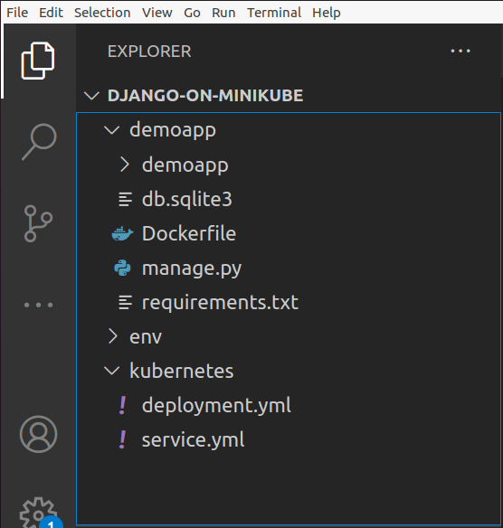

Today at work, I was asked whether I could deploy an application to a Kubernetes cluster within a few days. Although I am fairly familiar with container based technologies like docker and docker-compose, the Kubernetes side of things was something I hadn't explored before. Nevertheless, I replied that it shouldn't be a problem. Surely, how different could it be from docker-compose?

A few minutes of googling revealed what trouble I have put myself in. Although both docker-compose and Kubernetes are orchestration technologies, Kubernetes was deeper and much more complex.

I had no choice but to start learning Kubernetes properly. To learn the core concepts I watched [Techworld with Nana](https://www.youtube.com/channel/UCdngmbVKX1Tgre699-XLlUA). She is a fantastic teacher and explains devops concepts so esaily. I recommend you Watch her lessons to understand Kubernetes properly.

There was another catch, Kubernetes requires using a cloud service provider such as AWS/Azure/GCP. Of course I wouldn't like to pay cloud providers for just a learning purpose. So I found an alternative **Minikube** which offers a solution to run a Kubernetes cluster on your local machine.

So here are the steps I followed to set up Kubernetes locally and run a small web program (Django) in it.

## 0. Prerequisites

Make sure docker is installed on your machine.

## 1. Install Minikube

#### 1.1 Download and install Minikube

```bash
$ curl -LO https://storage.googleapis.com/minikube/releases/latest/minikube_latest_amd64.deb
$ sudo dpkg -i minikube_latest_amd64.deb
```

#### 1.2 Explore Minkube

After installation use the following CLI commands to test out minikube

```bash
$ minikube start        # Start minikube
$ minikube status       # Shows status
$ minikube dashboard    # Takes you to a browser based dashboard
$ minikube ip           # Shows ip of the minikube node
```

## 2. Set up the project

I deployed a simple hello-world app django app on Kubernetes. Here is how my project is structured.



The project has three main parts:
* The virtualenv
* The django project
    * Containerize the django app
* The Kubernetes yaml files

We will setup a minimal setup for these now.

#### 2.1 Set up virtualenv

The virtualenv is not something that Kubernetes requires. We are using it just to setup django.

```bash
$ sudo apt install python3-pip
$ virtualenv env
$ . env/bin/activate # Activates the environment
$ pip install django
```

#### 2.2 Set up the django project

```bash
$ django-admin startproject demoapp
```

We are not going to write any django code. Let's stay happy with the default page that django shows. We however, will add app dependencies and Dockerfile for the _demoapp_.

Add a requirements.txt file inside demoaap

```bash
$ pip freeze > demoapp/requirements.txt
```

Next, add a Dockerfile inside demoapp

```docker
FROM python:3.8-slim

RUN mkdir /app
ADD . /app
WORKDIR /app

EXPOSE 8000

RUN pip install -r /app/requirements.txt
RUN ls
CMD ["python",  "manage.py",  "runserver",  "0.0.0.0:8000"]
```

Now, lets containerize the app and push it to docker hub so that our Kubernetes deployments can pull it from there.

In the root project run

```bash
## replace the "rafed123/django-kube:latest" with your own "username/project-name:tag". Here username is the user name on dockerhub
$ docker build -t rafed123/django-kube:latest demoapp

## Login to docker hub if you're already not logged in
$ docker login

## push the image to hub.docker.com
$ docker push rafed123/django-kube:latest
```

## 3. Deploying on Kubernetes

Now we are going to have our main dish- deploying to Kubernetes.

#### 3.1 Install kubectl

At first install kubectl.

```bash
$ sudo snap install kubectl --classic
```

Wait a second. We already installed minikube. What is kubectl then?

Minikube is a platform where the Kubernetes cluster runs. Kubectl is a CLI which can access this cluster and make deployments to it. You can compare Minikube to a cloud service provider like AWS/Azure/GCP. Using Kubectl to make deployments on Minikube is the same as making deployments on Kubernetes engines on any cloud platform.

#### 3.2 Write the deployment yaml files

In the Kubernetes directory, make the following two yaml files

1. deployment.yml

```yml
apiVersion: apps/v1
kind: Deployment
metadata:
  name: django-backend
  labels:
    app: django-backend
spec:
  replicas: 1
  selector:
    matchLabels:
      app: django-backend
  template:
    metadata:
      labels:
        app: django-backend
    spec:
      containers:
        - name: django-kube
          imagePullPolicy: Always
          image: rafed123/django-kube:latest
          command: ["./manage.py", "runserver", "0.0.0.0:8000"]
          ports:
          - containerPort: 8000
```

2. service.yml

```yml
apiVersion: v1
kind: Service
metadata:
  name: nginx
  labels:
    app: nginx
spec:
  type: NodePort
  selector:
    app: django-backend
  ports:
    - port: 8000
      targetPort: 8000
```

At this point it's best to take a break and study a bit about how Kubernetes deployments work. If you haven't yet taken Nanas lessons from [Techworld with Nana](https://www.youtube.com/channel/UCdngmbVKX1Tgre699-XLlUA) yet, now is a good time to do so. 

I'll still, however, try to explain what I'm doing here. In Kubernetes, we write yaml files to define our infrastructure. And the infrastructure definitions is typically divided into multiple yaml files. In our case we have-
1. a deployment config (deployment.yml)
2. a service config (service.yml)

A **deployment** config tells how to deploy our main backend apps, in our case, the django app.

However, these deployed apps are not accessible by default. To make them accessible, we define **service** configs that can tell how to access the backend deployments.

I hope the concepts of **depoyment** and **service** is clear. If you still find the concepts shaky, I once again recommend Nana's lessons from [Techworld with Nana](https://www.youtube.com/channel/UCdngmbVKX1Tgre699-XLlUA).

#### 3.3 Use kubectl to push deployments and services

Let's go to our Kubernetes directory first.

```bash
$ cd Kubernetes
```

Let's make our django app deployment

```bash
## This deploys our app to the Kubernetes cluster
$ kubectl apply -f deployment.yml
```

To make this app available, we now need to deploy our service

```bash
## This deploys the service
$ kubectl apply -f service.yml
```


Let's check what happened to the infrastructure.

```bash
$ kubectl get pods      # Check the pods
$ kubectl get deploy -A # Shows deployments made
$ kubectl get service   # Shows services made

## You can also check out the Kubernetes cluster 
## from the browser based dashboard
$ minikube dashboard
```

Now, the moment of truth! Let's access our application that is running on Kubernetes.

Takte the service name outputted by the _kubectl get service_ command and run

```bash
$ minikube service <service-name>
# OR
$ minikube service <service-name> --url ## And paste the URL in the browser
```

You should be able to see the django app default page! Congratulations!!! Your app is now running on a Kubernetes engine!

You can play with kubectl a little more. Try deleting deployments from the infrastructure.

```bash
kubectl delete svc/<service-name>
kubectl delete deploy django-backend -n default # -n for namespaces
```

I hope you have found this tutorial helpful and enjoyable. If something doesn't work, let me know down in the comment section down below.