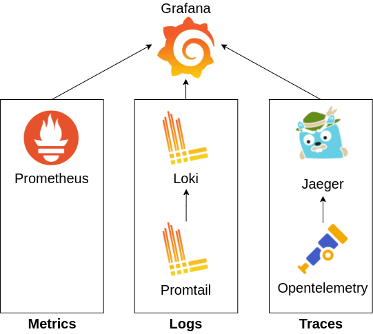
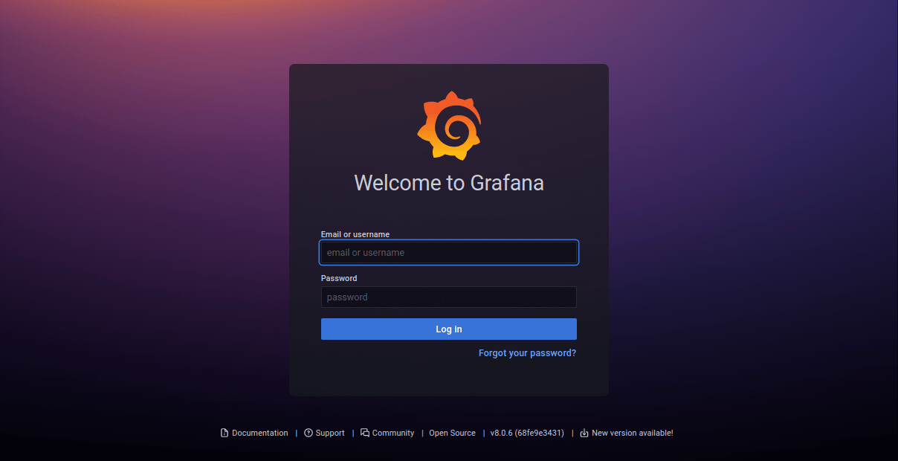
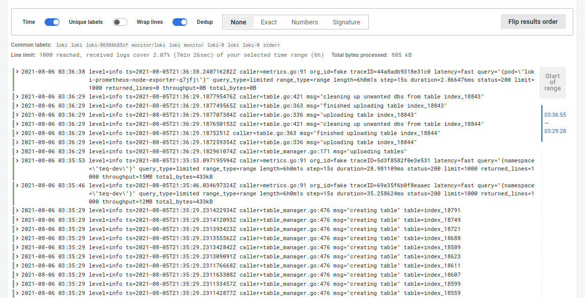

Metrics, Logs and Traces (MLT) are the three pillars of monitoring that can give us complete observability of a system.

In this article, we're going to set up all three of MLT on a Kubernetes platform to monitor an app made with microservices.
## What are metrics, logs and traces?

#### Metrics 
Metrics show the measure of how a system resource is used. They are typically shown in numbers. For example-
* How much CPU was used in the past hour?
* How much disk space is consumed?
* How much bandwidth has been used?

#### Logs
Logs are events that a running software records. For example-
* Log the stack trace of a runtime error
* Log when a user accesses the system

#### Traces
Traces show the path of a program's execution. In a modern distributed system, a request from a client may get processed through several services. It is important to know through which path a request got processed and how much time was needed in each node so that errors and bottlenecks can be identified.

## Technologies required

Implementing all of this requires a bunch of different technologies. It's easy to get lost, so take it easy. Let's introduce the programs we're gonna use.

1. **Grafana** _[Dashboard]_: This is a central dashboard where we will observe every MLT data collected by different services
2. **Prometheus** _[Monitoring]_: This collects kubernetes/pods/containers metrics (CPU, Memory, Bandwidth, etc) and sends them to grafana
3. **Promtail** _[Logging]_: This collects log data from containers
4. **Loki** _[Logging]_: This aggregates and stores all logs collected by Promtail and forwards them to Grafana
5. **Opentelemetry** _[Tracing]_: This is used to instrument an app to collect traces and then forward them to Jaeger
6. **Jaeger** _[Tracing]_: This collects tracing information for viewing. It can also optionally send them to grafana

The following figure summarizes our implementation.


## Installation

We usually make deployments in Kubernetes through YAML files containing our preferred deployment. However, writing such deployment files can be difficult and tedious when you're not a systems expert. Fortunately, there is **[Helm](https://helm.sh/)** which is sort of a package manager for Kubernetes. With helm, services can be installed in a Kubernetes cluster with a few commands.

In this tutorial, we will be using helm to deploy services in Kubernetes. Also, make sure you have kubectl installed and configured to manage your cluster.


#### Install kubectl and configure
```bash
$ sudo snap install kubectl --classic

## This example is for AWS
$ aws eks --region eu-west-1 update-kubeconfig --name name-of-cluster

## For GCP and Azure check out their CLI config documentation
```
#### Install Helm

```bash
$ sudo snap install helm --classic
```

Or try another method from their [official docs](https://helm.sh/docs/intro/install/)

#### Install the MLT Services

The procedures in this section have been made by following these official docs:
* [grafana.com](https://grafana.com/docs/loki/next/installation/helm/)
* [github.com/jaegertracing](https://github.com/jaegertracing/helm-charts)

We will deploy the required services in the **monitor** namespace. So let's create this namespace first.

```bash
$ kubectl create namespace monitor
```

Now, install the services. Make sure you have sufficient resources in the cluster before you proceed.

```bash
$ helm repo add grafana https://grafana.github.io/helm-charts
$ helm repo add jaegertracing https://jaegertracing.github.io/helm-charts
$ helm repo update

## Copy the values file from below
$ helm upgrade --install loki grafana/loki-stack  --namespace monitor --values values.yaml
$ helm upgrade --install jaeger jaegertracing/jaeger
```

Put the below config values in a **values.yaml** before running the grafana helm chart.

```yaml
grafana:
  image:
    repository: grafana/grafana
    tag: 8.0.6
  enabled: true
  persistence:
    enabled: true
    size: 500Mi
    # existingClaim: loki-grafana

prometheus:
  enabled: true
  alertmanager:
    persistentVolume:
      enabled: false
  server:
    persistentVolume:
      enabled: false

loki:
  enabled: true
  image:
    repository: grafana/loki
    tag: 2.2.1
  persistence:
    enabled: true
    size: 3Gi
  # existingClaim: loki-grafana
promtail:
  image:
    repository: grafana/promtail
    tag: 2.2.1
```

More config variables can be found at the following:
* [Grafana](https://github.com/helm/charts/blob/master/stable/grafana/values.yaml)
* [Loki](https://github.com/grafana/loki/blob/main/production/helm/loki/values.yaml)
* [Promtail](https://github.com/grafana/helm-charts/blob/main/charts/promtail/values.yaml)
* [Prometheus](https://github.com/helm/charts/blob/master/stable/prometheus/values.yaml)
* [Jaeger](https://github.com/jaegertracing/helm-charts/blob/main/charts/jaeger/values.yaml)


## Configuring the Services

#### Accessing the Grafana Dashboard

Access the grafana dashboard by making a proxy.

```bash
kubectl -n monitor port-forward service/loki-grafana 3000:80
```

Now hit on **localhost:3000** and you should see the grafana dashboard.



Use, username: admin, and password as the output of the following command.

```bash
$ kubectl get secret --namespace monitor loki-grafana -o jsonpath="{.data.admin-password}" | base64 --decode ; echo
```

#### Setup prometheus metrics dashboard

Grafana has tons of awesome dashboards built by the open source community. We will proceed to use those ones. To import a graph go to sidebar > create > import.


In the "import via grafana.com" input box enter ids of community-built dashboard. Search grafana.com for the dashboards. Or you can use mine below favorites.

Best kubernetes cluster dashboards for grafana:
* Summary dashboards
    * Kubernetes Cluster: 7249
    * K8s Cluster Summary: 8685
    * Kubernetes / Node Exporter Full: 12132
* Specific dashboards
    * Kubernetes / Compute Resources / Namespace (Pods): 12117
    * Kubernetes / Compute Resources / Node (Pods): 12119
    * Kubernetes / Compute Resources / Pod: 12120
    * Kubernetes / Networking / Cluster: 12124
    * Kubernetes / Networking / Namespace (Pods): 12125

Here's an example of what you could see.


#### Setup loki logs dashboard

On the left-hand side panel, go to create > dashboard. Click on add an empty panel. In this panel
* On the top right, change visualization to logs
* In data source, select loki
* Click on "Log browser" and select labels with which you'd like to filter the logs. I personally use namespaces and pods most.


Save the dashboard and you should see something like this!



Do check out the live tail feature, where the logs are live tailed as they are generated from the pods. Very useful for debugging applications.


<details>
    <summary>Legacy config</summary>

```bash
# Install prometheus
helm repo add prometheus-community https://prometheus-community.github.io/helm-charts
helm install prometheus prometheus-community/prometheus
kubectl expose service prometheus-server --type=NodePort --target-port=9090 --name=prometheus-server-np

# Install grafana
helm repo add grafana https://grafana.github.io/helm-charts

helm install grafana grafana/grafana --set persistence.enabled=true,persistence.type=pvc,persistence.size=10Gi 

kubectl expose service grafana --type=NodePort --target-port=3000 --name=grafana-np

# Use the password provided by this to login
kubectl get secret --namespace default grafana -o jsonpath="{.data.admin-password}" | base64 --decode ; echo

# Install loki
helm repo add loki https://grafana.github.io/loki/charts
helm repo update

helm upgrade --install loki loki/loki-stack --set grafana.enabled=true

helm install loki-stack grafana/loki-stack \  
                                --create-namespace \  
                                --namespace loki-stack \                                
    --set promtail.enabled=true,loki.enabled=true,loki.persistence.size=100Gi
```
</details>