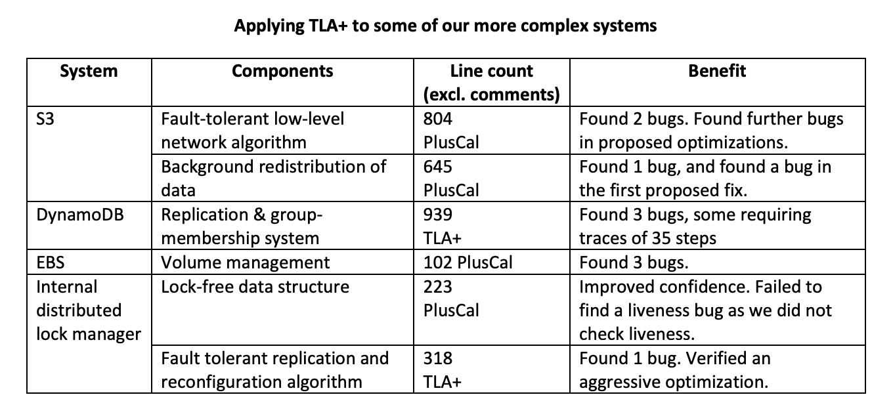

Formal Methods in Software Engineering use mathematical techniques and tools to specify, design, and verify software system behavior. These methods are crucial for dealing with the complexity and criticality of modern software systems operating in dynamic and uncertain environments. They are particularly essential in avionics, medical devices, and control systems, where failure could have catastrophic consequences.

By providing a mathematical foundation, formal methods ensure the reliability and safety of software systems. Developers can-
* reason about system behavior
* check for errors and inconsistencies during the development process, 
* enhance the system's quality 
* identify problems and early

#### Types of Formal Method Tools

Formal method tools come in many forms and can be grouped into several categories. Some of the categories are listed here for you to check out:
* Theorem Provers
* Rewrite Systems
* Model Checkers
* SAT Solvers
* SMT Solvers
* Static Analysis
* Dynamic Analysis
* Model-based Testing
* Modeling
* Verifiable Programming Languages

This article discusses three of the most widely used formal methods tools (which I know of) that are used in designing reliable software:
1. TLA+
1. Alloy
1. CoQ

#### 1. TLA+

TLA+ (Temporal Logic of Actions) is a formal specification language and toolset for specifying and verifying concurrent and distributed systems. It provides a mathematical framework for reasoning about the behavior of a system over time. Advantages of TLA+ include its ability to handle complex and concurrent systems, its support for reasoning about the behavior of a system over time, and its ability to generate test cases. TLA+ is heavily used by cloud service providers (like AWS) to detect bugs and reason about the behavior of their distributed systems. The following snippet from [here](https://lamport.azurewebsites.net/tla/formal-methods-amazon.pdf) shows bugs caught by AWS researchers using TLA+.

#### 2. Alloy 

Alloy is a declarative specification language for expressing complex structural constraints and behavior in a software system. It is based on first-order logic and provides a simple and powerful way to specify and analyze software systems. Although Alloy is designed with automatic analysis in mind, Alloy differs from many specification languages designed for model-checking in that it permits the definition of infinite models. The Alloy Analyzer is designed to perform finite scope checks even on infinite models. 

#### 3. CoQ

Coq is a formal proof management system. It provides a formal language to write mathematical definitions, executable algorithms and theorems together with an environment for semi-interactive development of machine-checked proofs. Typical applications include the certification of properties of programming languages (e.g. the CompCert compiler certification project, the Verified Software Toolchain for verification of C programs, or the Iris framework for concurrent separation logic), the formalization of mathematics (e.g. the full formalization of the Feit-Thompson theorem, or homotopy type theory), and teaching. <cite>[^1]</cite>

[^1]: The Coq Proof Assistant, [coq.inria.fr](https://coq.inria.fr) 

#### Conclusion

In conclusion, TLA+, Alloy and CoQ are some of the most widely used formal methods tools in Software Engineering that I know of. As the use of formal methods tools are very niche, it is very hard to find teams/companies that industrially use them. Nevertheless, [ligurio](https://github.com/ligurio/) has done an awesome job compiling a list of companies that use formal methods along with what tools they use at [github.com/ligurio/practical-fm](https://github.com/ligurio/practical-fm). If you are someone looking to dig into formal method tools, what they are, and how they are used in the industry, I hope that this article has been able to provide you with a few pointers.