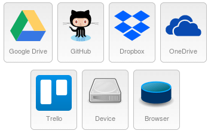
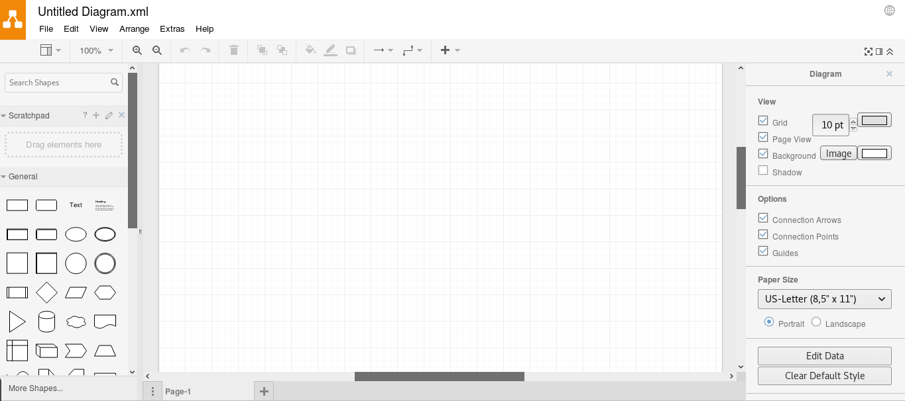

If you're looking for a free and awesome prototyping/wireframing/mockup UI tool, search no more, go to [draw.io](https://draw.io)

There are a lot of prototyping tools available online but most of them are very annoying. Either they are paid or requires signing up. And the most annoying are the ones where you've finally drawn something and then they say you need to sign up to download the image.

Draw.io is the tool that works best for me. Here's why:

1. No registration.
1. Unlimited free usage.
3. Collaboration - you can edit a single diagram with multiple users in real-time, without any major conflict.
4. Save images in the cloud. Even the slightest changes made to an existing file will be automatically saved. The following cloud storage are currently supported.

5. Very simple and intuitive UI.

6. It has many default templates to choose from. It's better you try them out instead of me making explanations. Currently, the following drawings are notable that are supported along with many others.
    * Charts
    * Engineering
    * Flowcharts
    * Networks
    * Software
    * Tables
    * UML
7. It's open-sourced. You can see the codes that made this at [github.com/jgraph/drawio](https://github.com/jgraph/drawio).

Here are some diagrams that I made with draw.io for some classroom projects. Everything has been made just by dragging and dropping shapes from the rich library of shapes that draw.io offers.

*Swimlane Diagram*

*UML Digram*

*Webpage Mockup*

Note that, not all shapes are visible on the left sidebar. There are much much more! Just search for what you want in the search bar and you'll get tons of shapes that will suit your needs. For example, the webpage designed above was made using bootstrap elements. Just search "bootstrap + the element you need" and you'll get bootstrap elements. Search for "browser" and you'll get the browser frame to put the webpage in.

Get over those clickjacking websites and start drawing with draw.io!